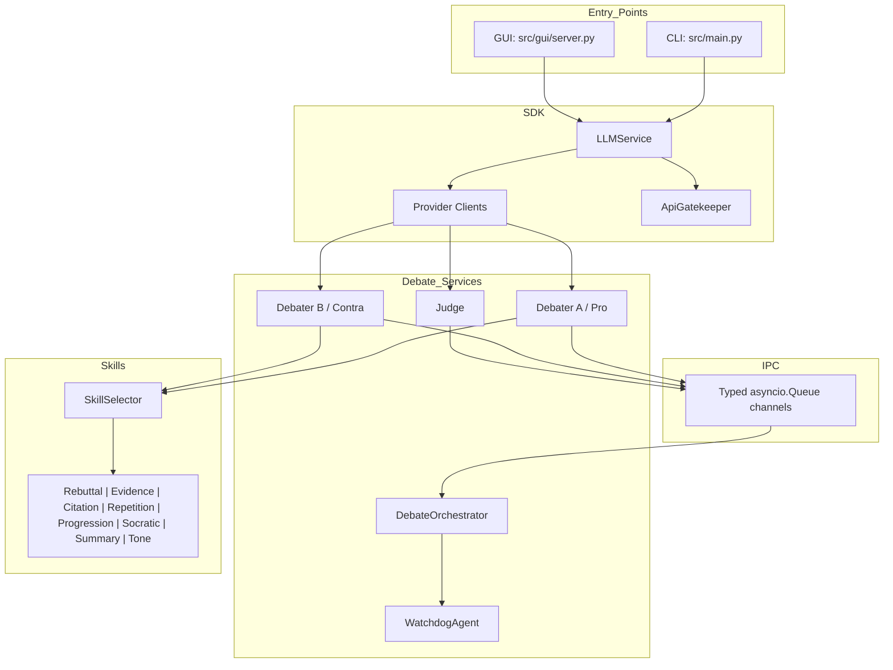
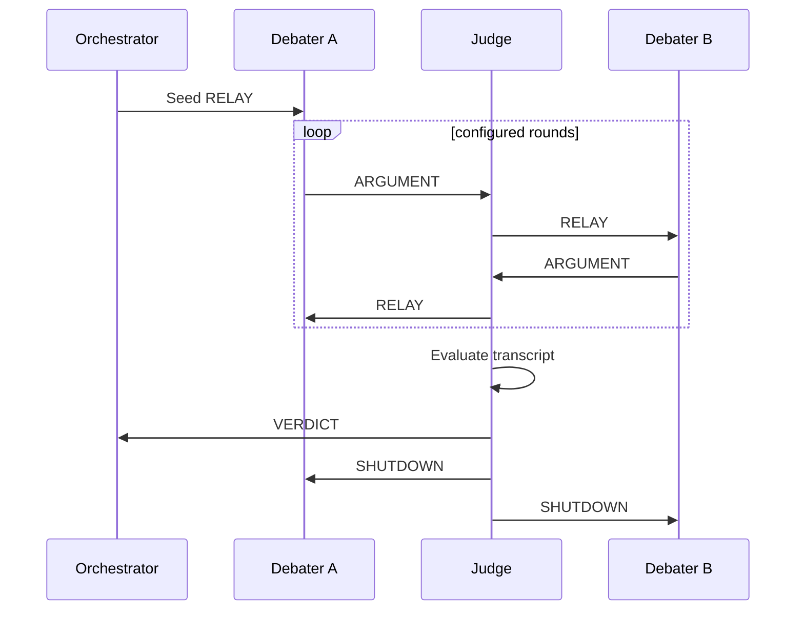

# AI Debate Platform

AI Debate Platform is a modular Python 3.12 application for running structured debates between autonomous AI agents. Two debaters argue opposing stances on a configurable topic while a separate judge agent manages turn-taking, relays arguments through typed IPC channels, evaluates the final transcript, and produces a scored verdict.

The project demonstrates a complete multi-agent workflow rather than a single prompt call: provider routing, rate limiting, retry handling, watchdog supervision, role-specific skills, deterministic mock execution, browser and CLI entry points, live transcript streaming, and reproducible exports for grading and inspection.


## Evaluation Evidence

Last verified on 2026-05-30:

| Criterion | Evidence | Verification command |
|---|---|---|
| Python package managed with `uv` | `pyproject.toml` and `uv.lock` are committed | `uv sync` |
| Full automated test suite | `419 passed` | `uv run pytest -q` |
| Coverage above 85% | `91.76%` total coverage | `uv run pytest --cov=src --cov-report=term-missing` |
| Ruff linting | `All checks passed!` | `uv run ruff check src tests` |
| Source file line cap | Every production file in `src/` is <= 150 lines | `uv run pytest tests/unit/test_submission_readiness.py -q` |
| No committed secrets | `.env.example` only contains placeholders; `.env` is ignored | `git check-ignore -v .env` |
| Assignment traceability | 33 requirements mapped to implementation and tests | [docs/REQUIREMENTS_TRACEABILITY.md](docs/REQUIREMENTS_TRACEABILITY.md) |

Key grading artifacts:

- Product requirements: [docs/PRD.md](docs/PRD.md)
- Architecture plan: [docs/PLAN.md](docs/PLAN.md)
- Testing guide: [docs/TESTING.md](docs/TESTING.md)
- Limitations: [docs/LIMITATIONS.md](docs/LIMITATIONS.md)
- Latest debate transcript: [docs/debate_transcript.md](docs/debate_transcript.md)
- Latest skill log: [docs/skill_log.md](docs/skill_log.md)
- Skill configuration: [config/skills.json](config/skills.json)

## What We Built

The system is organized as a production-style multi-agent application with clear boundaries between orchestration, model access, safeguards, skills, and presentation.

| Area | Implementation |
|---|---|
| Multi-agent debate | Pro debater, Contra debater, and Judge agents run a full debate across configurable rounds. |
| Judge-led orchestration | The judge relays turns, preserves the debate flow, evaluates the final transcript, and emits a structured verdict. |
| Typed IPC | Agents communicate through typed `asyncio.Queue` channels instead of direct debater-to-debater calls. |
| Provider routing | OpenAI, Gemini, Groq, ZAI, OpenRouter, and deterministic Mock mode share a common client interface. |
| API safeguards | `ApiGatekeeper` handles rate limits, retries, timeouts, token accounting, and estimated cost tracking. |
| Watchdog supervision | `WatchdogAgent` monitors long-running debate tasks and restarts failed work where appropriate. |
| Debate skills | Rebuttal, evidence, citation, progression, Socratic, summarization, tone moderation, and repetition guard skills can guide each turn. |
| User interfaces | The project includes both a CLI and a browser GUI with live NDJSON transcript streaming. |
| Exports | Each run can export Markdown and JSON transcripts, verdicts, token usage, and skill logs. |
| Testability | Mock mode allows deterministic local runs without API keys or network calls. |

## Engineering Highlights

- Clean package layout under `src/` with separate modules for CLI, GUI, IPC, SDK clients, services, shared utilities, skills, and tools.
- Configuration-driven behavior through `config/setup.json`, `models.json`, `rate_limits.json`, `pricing.json`, and skill configuration files.
- Assignment-focused quality gates: 419 passing tests, 91.76% coverage, Ruff linting, and a tested 150-line cap for production source files.
- Safe submission defaults: `.env.example` contains only placeholders, `.env` is ignored, and mock mode works without secrets.
- Traceability documentation maps requirements to implementation and tests in [docs/REQUIREMENTS_TRACEABILITY.md](docs/REQUIREMENTS_TRACEABILITY.md).

## Quick Start

Run a complete deterministic debate with no API keys and no network calls:

```bash
uv sync
uv run python -m src.main \
  --topic "AI in education" \
  --stance-a "AI improves learning" \
  --stance-b "AI harms deep learning" \
  --provider-a mock \
  --provider-b mock \
  --judge-provider mock
```

Launch the GUI:

```bash
uv run python -m src.gui.server
# Open http://127.0.0.1:8000
```

Run with real providers after adding API keys to `.env`:

```bash
uv run python -m src.main \
  --topic "Universal Basic Income" \
  --stance-a "UBI should be implemented" \
  --stance-b "UBI is economically harmful" \
  --provider-a groq \
  --provider-b zai \
  --judge-provider openrouter
```

## Installation

Prerequisites:

- Python 3.12 or higher
- `uv` package manager

```bash
git clone <repo-url>
cd ai-debate-platform
uv sync
cp .env.example .env
```

`.env.example` contains placeholders for the supported real providers:

```dotenv
OPENAI_API_KEY=your_openai_key_here
GEMINI_API_KEY=your_gemini_key_here
GROQ_API_KEY=your_groq_key_here
ZAI_API_KEY=your_zai_key_here
OPENROUTER_API_KEY=your_openrouter_key_here
```

Mock mode does not require `.env`.

## Architecture



Debate flow:



## Configuration

Runtime behavior is configured under `config/`:

| File | Purpose |
|---|---|
| [config/setup.json](config/setup.json) | Debate rounds, word/token limits, provider defaults, GUI server settings, watchdog timing, skill pool |
| [config/models.json](config/models.json) | Role-to-provider defaults and model overrides |
| [config/rate_limits.json](config/rate_limits.json) | Provider RPM, timeout, retry, and retry-after settings |
| [config/pricing.json](config/pricing.json) | Token price estimates by provider/model |
| [config/skills.json](config/skills.json) | Skill enablement and priority weights |
| [config/skills_prompts.json](config/skills_prompts.json) | Prompt fragments injected by skills |

Supported providers:

| Provider | Client | Env var |
|---|---|---|
| OpenAI | `OpenAIClient` | `OPENAI_API_KEY` |
| Gemini | `GeminiClient` | `GEMINI_API_KEY` |
| Groq | `GroqClient` | `GROQ_API_KEY` |
| ZAI | `ZaiClient` | `ZAI_API_KEY` |
| OpenRouter | `OpenRouterClient` | `OPENROUTER_API_KEY` |
| Mock | `MockAIClient` | None |

## Testing

```bash
# Full suite
uv run pytest -q

# Coverage report
uv run pytest --cov=src --cov-report=term-missing

# Lint
uv run ruff check src tests

# Submission-specific checks
uv run pytest tests/unit/test_submission_readiness.py -q
```

The tests are deterministic and do not require real API keys because provider calls are mocked or routed through `MockAIClient`.

## Project Structure

```text
ai-debate-platform/
|-- config/                 # Runtime configuration and pricing/rate settings
|-- docs/                   # PRD, PLAN, testing guide, traceability, limitations, transcript
|-- gui/                    # Browser frontend
|-- src/
|   |-- cli/                # Interactive and argument-based CLI
|   |-- gui/                # HTTP server and streaming debate runner
|   |-- ipc/                # Message types and typed queue channels
|   |-- models/             # Pydantic data models
|   |-- sdk/                # Provider clients and LLMService
|   |-- services/           # Debater, Judge, Orchestrator, Watchdog, exporter
|   |-- shared/             # Config, logger, constants, gatekeeper
|   |-- skills/             # Skill classes and selector
|   `-- tools/              # Web search and search quality helpers
|-- tests/                  # Unit and integration tests
|-- .env.example            # Safe API key template
|-- pyproject.toml
`-- uv.lock
```

## Screenshots


## License

MIT
