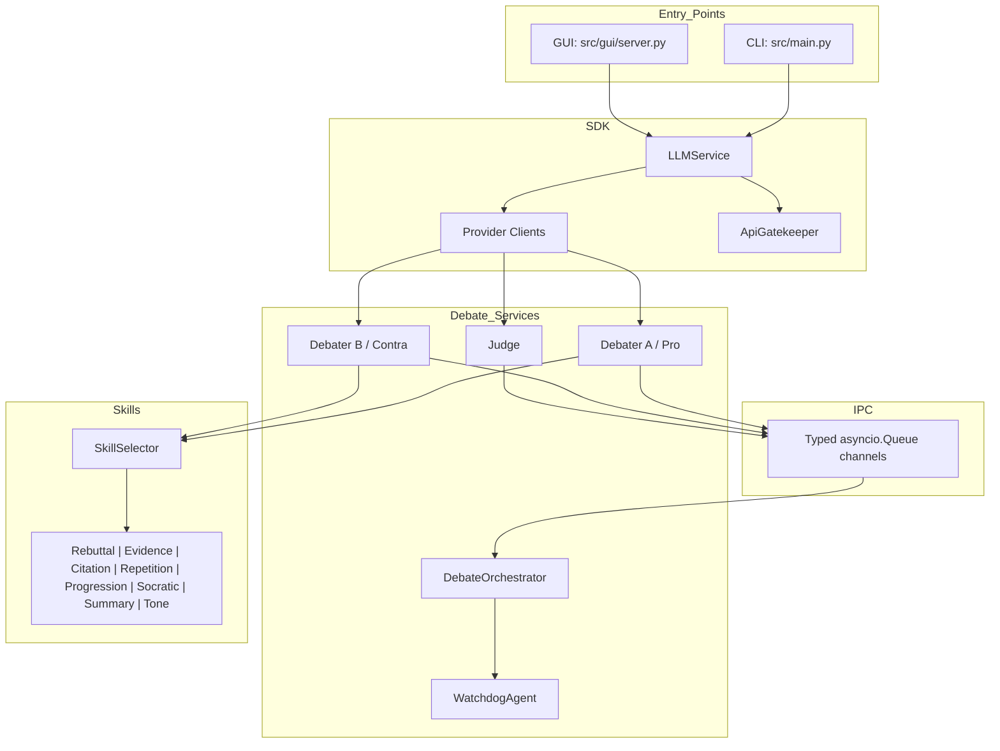
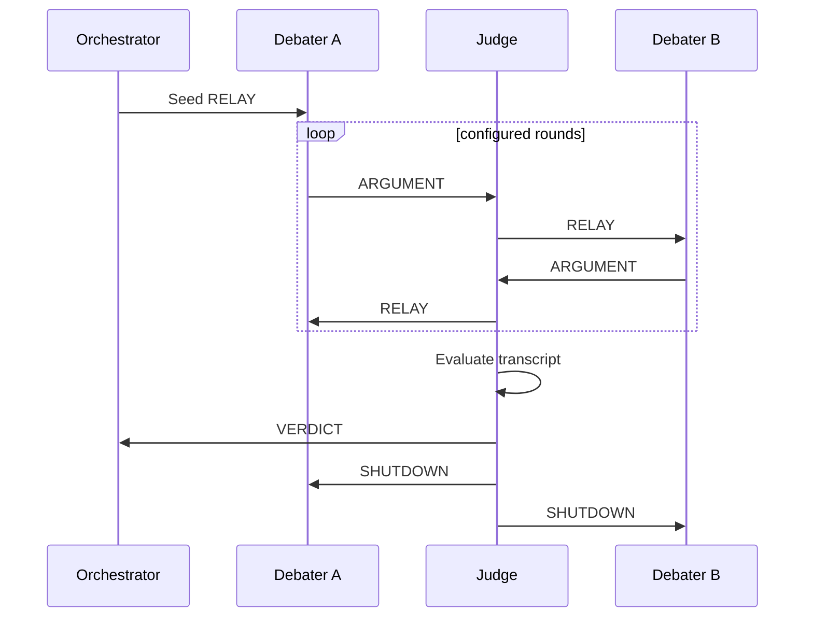

# AI Debate Platform

AI Debate Platform is a modular Python 3.12 application for running structured debates between autonomous AI agents. Two debaters argue opposing stances on a configurable topic while a separate judge agent manages turn-taking, relays arguments through typed IPC channels, evaluates the final transcript, and produces a scored verdict.

The project demonstrates a complete multi-agent workflow rather than a single prompt call: provider routing, rate limiting, retry handling, watchdog supervision, role-specific skills, deterministic mock execution, browser and CLI entry points, live transcript streaming, and reproducible exports for grading and inspection.


## Project Overview

This project turns a debate topic into a complete moderated AI debate. A user chooses a topic, writes two opposing stances, selects model providers for each debater and the judge, and starts the run from either the CLI or the browser GUI. The system then coordinates the agents, records each turn, applies debate skills, manages provider calls safely, and returns a final judge verdict with exported evidence.

The main work was building the platform around real software boundaries instead of one large script. The codebase separates the user interfaces, model-provider SDK, debate orchestration, IPC messages, safety/reliability controls, debate skills, exports, and tests. That structure makes the project easier to inspect, grade, run locally, and extend later.

In a normal debate run:

1. The user enters a topic, two stances, providers, and round count.
2. The orchestrator creates Debater A, Debater B, and Judge agents.
3. Debater A argues for the first stance and sends the argument through IPC.
4. The judge receives the argument, records it, and relays it to Debater B.
5. Debater B responds with the opposing stance, also through the judge.
6. The loop continues for the configured number of rounds.
7. The judge evaluates the full transcript and produces a scored verdict.
8. The run is exported as transcript, JSON data, token/cost summaries, and skill logs.

## What The Platform Does

- Runs full Pro-vs-Contra debates with a separate judge agent.
- Lets each role use a different provider, including OpenAI, Gemini, Groq, ZAI, OpenRouter, or deterministic Mock mode.
- Streams live debate events to the browser GUI while also supporting a terminal workflow.
- Applies debate skills such as rebuttal, evidence use, citation guidance, progression, Socratic questioning, tone moderation, summarization, and repetition control.
- Protects external model calls with rate limiting, retries, timeouts, token tracking, and estimated cost tracking.
- Exports results so the debate can be reviewed after the run instead of disappearing in terminal output.
- Includes a mock execution path for grading, tests, and demos without API keys.

## Screenshots

The screenshots below show the browser workflow and the output from a completed debate run. In the generated `results/` artifacts, the sample debate topic was **"who is better barcelona or realmadrid"**. Debater A argued for Real Madrid, Debater B argued for Barcelona, and the judge awarded the win to Contra / Barcelona with a final score of **82/100** against **66/100**.

The run was a good demonstration of the platform because the agents did not only trade isolated claims. The debate developed across several rounds: Real Madrid opened with Champions League dominance and historic success, while Barcelona countered with La Masia, tactical identity, cultural impact, adaptability, and social contribution. The judge favored Barcelona because Contra gave stronger rebuttals, answered Pro's financial and trophy-count arguments more directly, and kept a more consistent narrative.

The exported skill log also shows that the debate system was active during the run. Both sides repeatedly used `repetition_guard`, `rebuttal`, `progression`, and `tone_moderation`; Pro leaned on `evidence` and `citation`, while Contra used `socratic` questioning to challenge assumptions. The exported token summary for this run recorded **28,804 total tokens** with an estimated cost of **$0.009593 USD**.

### Setup Screen

The setup screen shows the core controls exposed to the user: topic, opposing stances, provider choices, judge provider, and round count. This is where the platform turns a plain debate question into a configured multi-agent run.


### Live Transcript

The live transcript view shows the debate while it is running. Each completed argument is streamed into the browser as an NDJSON event, so the user can follow the back-and-forth instead of waiting for a final block of text.


### Judge Verdict

The verdict screen shows the final evaluation after the judge reviews the transcript. In the observed run, Contra / Barcelona won because the judge rated its rebuttal quality, relevance, clarity, and evidence use higher than Pro's case for Real Madrid.


## Quick Start

Run a complete deterministic debate with no API keys and no network calls:

```bash
uv sync
uv run python -m src.main \
  --topic "AI in education" \
  --stance-a "AI improves learning" \
  --stance-b "AI harms deep learning" \
  --provider-a mock \
  --provider-b mock \
  --judge-provider mock
```

Launch the GUI:

```bash
uv run python -m src.gui.server
# Open http://127.0.0.1:8000
```

Run with real providers after adding API keys to `.env`:

```bash
uv run python -m src.main \
  --topic "Universal Basic Income" \
  --stance-a "UBI should be implemented" \
  --stance-b "UBI is economically harmful" \
  --provider-a groq \
  --provider-b zai \
  --judge-provider openrouter
```

## Installation

Prerequisites:

- Python 3.12 or higher
- `uv` package manager

```bash
git clone <repo-url>
cd ai-debate-platform
uv sync
cp .env.example .env
```

`.env.example` contains placeholders for the supported real providers:

```dotenv
OPENAI_API_KEY=your_openai_key_here
GEMINI_API_KEY=your_gemini_key_here
GROQ_API_KEY=your_groq_key_here
ZAI_API_KEY=your_zai_key_here
OPENROUTER_API_KEY=your_openrouter_key_here
```

Mock mode does not require `.env`.

## What We Built

The completed work covers the full application, not only the agent prompts. The repository contains the debate engine, model integration layer, reliability controls, two user interfaces, configuration files, documentation, exported sample artifacts, and a deterministic test suite.

| Area | Implementation |
|---|---|
| Multi-agent debate | Pro debater, Contra debater, and Judge agents run a full debate across configurable rounds. |
| Judge-led orchestration | The judge relays turns, preserves the debate flow, evaluates the final transcript, and emits a structured verdict. |
| Typed IPC | Agents communicate through typed `asyncio.Queue` channels instead of direct debater-to-debater calls. |
| Provider routing | OpenAI, Gemini, Groq, ZAI, OpenRouter, and deterministic Mock mode share a common client interface. |
| API safeguards | `ApiGatekeeper` handles rate limits, retries, timeouts, token accounting, and estimated cost tracking. |
| Watchdog supervision | `WatchdogAgent` monitors long-running debate tasks and restarts failed work where appropriate. |
| Debate skills | Rebuttal, evidence, citation, progression, Socratic, summarization, tone moderation, and repetition guard skills can guide each turn. |
| User interfaces | The project includes both a CLI and a browser GUI with live NDJSON transcript streaming. |
| Exports | Each run can export Markdown and JSON transcripts, verdicts, token usage, and skill logs. |
| Testability | Mock mode allows deterministic local runs without API keys or network calls. |

## Work Completed

- Built the project scaffold, dependency lockfile, configuration system, logging, and package layout.
- Implemented provider clients and a shared SDK layer for real and mock model calls.
- Implemented the debate agents, orchestrator, judge relay, transcript memory, and verdict flow.
- Implemented typed IPC channels so agent communication is explicit and testable.
- Implemented gatekeeper and watchdog services for rate limits, retries, timeouts, and long-running task supervision.
- Implemented the debate skill system and per-turn skill logging.
- Implemented the CLI, browser GUI, streaming endpoint, and static-file safety checks.
- Implemented exports for transcripts, structured JSON results, token usage, cost summaries, and skill logs.
- Added documentation for requirements, architecture, testing, known limitations, and traceability.
- Added broad unit and integration coverage, plus submission-specific quality checks.

## Architecture



Debate flow:



## Configuration

Runtime behavior is configured under `config/`:

| File | Purpose |
|---|---|
| [config/setup.json](config/setup.json) | Debate rounds, word/token limits, provider defaults, GUI server settings, watchdog timing, skill pool |
| [config/models.json](config/models.json) | Role-to-provider defaults and model overrides |
| [config/rate_limits.json](config/rate_limits.json) | Provider RPM, timeout, retry, and retry-after settings |
| [config/pricing.json](config/pricing.json) | Token price estimates by provider/model |
| [config/skills.json](config/skills.json) | Skill enablement and priority weights |
| [config/skills_prompts.json](config/skills_prompts.json) | Prompt fragments injected by skills |

Supported providers:

| Provider | Client | Env var |
|---|---|---|
| OpenAI | `OpenAIClient` | `OPENAI_API_KEY` |
| Gemini | `GeminiClient` | `GEMINI_API_KEY` |
| Groq | `GroqClient` | `GROQ_API_KEY` |
| ZAI | `ZaiClient` | `ZAI_API_KEY` |
| OpenRouter | `OpenRouterClient` | `OPENROUTER_API_KEY` |
| Mock | `MockAIClient` | None |

## Testing And Evaluation Evidence

The tests are deterministic and do not require real API keys because provider calls are mocked or routed through `MockAIClient`.

```bash
# Full suite
uv run pytest -q

# Coverage report
uv run pytest --cov=src --cov-report=term-missing

# Lint
uv run ruff check src tests

# Submission-specific checks
uv run pytest tests/unit/test_submission_readiness.py -q
```

Last verified on 2026-05-30:

| Criterion | Evidence | Verification command |
|---|---|---|
| Python package managed with `uv` | `pyproject.toml` and `uv.lock` are committed | `uv sync` |
| Full automated test suite | `419 passed` | `uv run pytest -q` |
| Coverage above 85% | `91.76%` total coverage | `uv run pytest --cov=src --cov-report=term-missing` |
| Ruff linting | `All checks passed!` | `uv run ruff check src tests` |
| Source file line cap | Every production file in `src/` is <= 150 lines | `uv run pytest tests/unit/test_submission_readiness.py -q` |
| No committed secrets | `.env.example` only contains placeholders; `.env` is ignored | `git check-ignore -v .env` |
| Assignment traceability | 33 requirements mapped to implementation and tests | [docs/REQUIREMENTS_TRACEABILITY.md](docs/REQUIREMENTS_TRACEABILITY.md) |

## Engineering Highlights

- Clean package layout under `src/` with separate modules for CLI, GUI, IPC, SDK clients, services, shared utilities, skills, and tools.
- Configuration-driven behavior through `config/setup.json`, `models.json`, `rate_limits.json`, `pricing.json`, and skill configuration files.
- Assignment-focused quality gates: 419 passing tests, 91.76% coverage, Ruff linting, and a tested 150-line cap for production source files.
- Safe submission defaults: `.env.example` contains only placeholders, `.env` is ignored, and mock mode works without secrets.
- Traceability documentation maps requirements to implementation and tests in [docs/REQUIREMENTS_TRACEABILITY.md](docs/REQUIREMENTS_TRACEABILITY.md).

## Project Structure

```text
ai-debate-platform/
|-- config/                 # Runtime configuration and pricing/rate settings
|-- docs/                   # PRD, PLAN, testing guide, traceability, limitations, transcript
|-- gui/                    # Browser frontend
|-- src/
|   |-- cli/                # Interactive and argument-based CLI
|   |-- gui/                # HTTP server and streaming debate runner
|   |-- ipc/                # Message types and typed queue channels
|   |-- models/             # Pydantic data models
|   |-- sdk/                # Provider clients and LLMService
|   |-- services/           # Debater, Judge, Orchestrator, Watchdog, exporter
|   |-- shared/             # Config, logger, constants, gatekeeper
|   |-- skills/             # Skill classes and selector
|   `-- tools/              # Web search and search quality helpers
|-- tests/                  # Unit and integration tests
|-- .env.example            # Safe API key template
|-- pyproject.toml
`-- uv.lock
```

## Key Documentation

- Product requirements: [docs/PRD.md](docs/PRD.md)
- Architecture plan: [docs/PLAN.md](docs/PLAN.md)
- Full project tracker: [docs/TODO.md](docs/TODO.md)
- Testing guide: [docs/TESTING.md](docs/TESTING.md)
- Limitations: [docs/LIMITATIONS.md](docs/LIMITATIONS.md)
- Requirements traceability: [docs/REQUIREMENTS_TRACEABILITY.md](docs/REQUIREMENTS_TRACEABILITY.md)
- Latest debate transcript: [docs/debate_transcript.md](docs/debate_transcript.md)
- Latest skill log: [docs/skill_log.md](docs/skill_log.md)
- Skill configuration: [config/skills.json](config/skills.json)

## License

MIT
