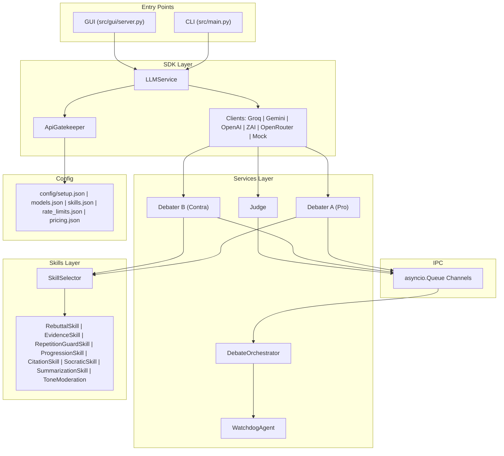
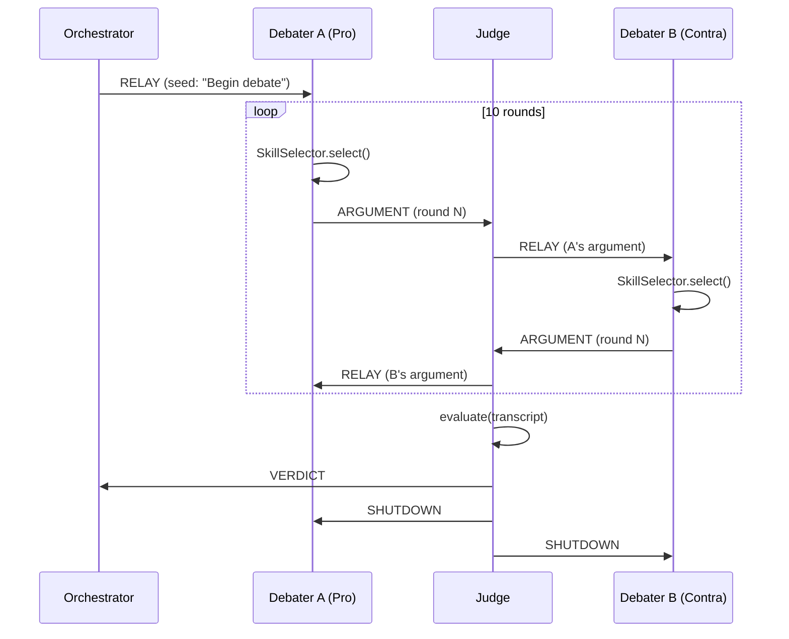
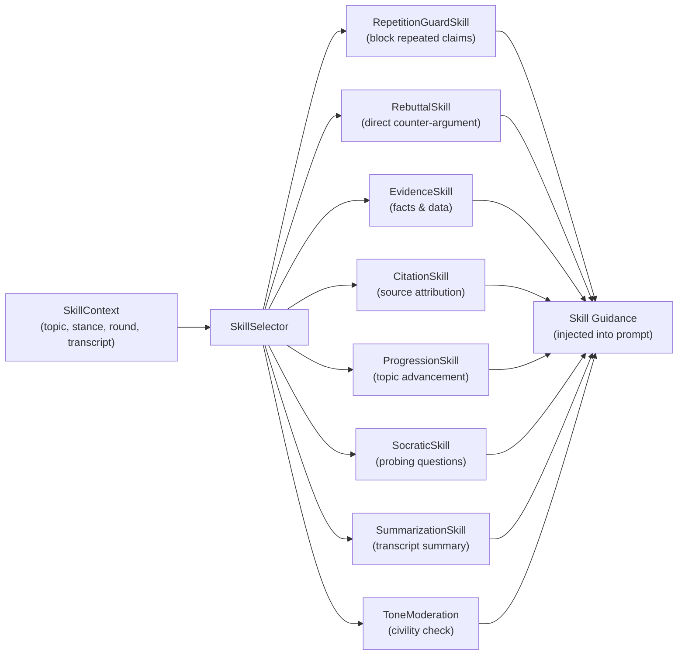

# AI Debate Platform

A professional, modular Python platform where AI agents engage in structured competitive debates — with a judge, skill selection, fault tolerance, and multi-provider support.


---

## Architecture Overview



---

## Debate Flow



---

## Skill-Selection Pipeline



---

## Installation

### Prerequisites

- Python 3.12 or higher
- [`uv`](https://docs.astral.sh/uv/) package manager

```bash
# Install uv (macOS / Linux)
curl -LsSf https://astral.sh/uv/install.sh | sh

# Clone the repository
git clone <repo-url>
cd ai-debate-platform

# Install all dependencies (creates .venv automatically)
uv sync
```

### Environment Setup

```bash
# Copy the example environment file
cp .env-example .env

# Edit .env and add your API keys (only needed for real providers)
# OPENAI_API_KEY=sk-...
# GEMINI_API_KEY=...
# GROQ_API_KEY=gsk_...
# ZAI_API_KEY=...
# OPENROUTER_API_KEY=sk-or-...
```

---

## Quick Start

### Mock Demo — No API Keys Required

```bash
# One-command mock debate (completely free, no network calls)
uv run python -m src.main \
  --topic "AI in education" \
  --stance-a "AI improves learning" \
  --stance-b "AI harms education" \
  --provider-a mock \
  --provider-b mock
```

### With Real Providers

```bash
# Groq vs ZAI (both have free tiers)
uv run python -m src.main \
  --topic "Universal Basic Income" \
  --stance-a "UBI should be implemented" \
  --stance-b "UBI is economically harmful" \
  --provider-a groq \
  --provider-b zai

# OpenAI vs Gemini
uv run python -m src.main \
  --topic "Space colonisation" \
  --stance-a "Humanity must colonise Mars" \
  --stance-b "We should fix Earth first" \
  --provider-a openai \
  --provider-b gemini
```

### Interactive CLI Menu

```bash
uv run python -m src.main
# Follow the on-screen prompts to configure topic, stances, and providers
```

### GUI

```bash
uv run python -m src.gui.server
# Open http://127.0.0.1:8000 in your browser
```

---

## Configuration Guide

All runtime parameters are loaded from `config/` — no hardcoded values exist in source code.

### `config/setup.json`

Controls all debate and service parameters:

| Section | Key | Default | Description |
|---------|-----|---------|-------------|
| `api` | `groq_model` | `llama-3.1-8b-instant` | Model used for Groq provider |
| `api` | `gemini_model` | `gemini-2.5-flash` | Model used for Gemini provider |
| `api` | `openrouter_model` | `openai/gpt-oss-120b:free` | Model used for OpenRouter |
| `debate` | `total_rounds` | `10` | Number of debate rounds (20 turns total) |
| `debate` | `min_rounds` / `max_rounds` | `1` / `10` | GUI round bounds |
| `debate` | `debater_max_words` | `130` | Hard word limit per debater response |
| `debate` | `judge_max_words` | `200` | Hard word limit for judge verdict |
| `debate` | `temperature` | `0.7` | LLM sampling temperature |
| `defaults` | `provider_a` | `zai` | Default provider for Debater A |
| `defaults` | `provider_b` | `groq` | Default provider for Debater B |
| `defaults` | `judge_provider` | `groq` | Default provider for the Judge |
| `defaults` | `topic` / `stance_a` / `stance_b` | AI threat defaults | Browser fallback debate inputs |
| `providers` | `available` / `labels` | provider list | CLI options and GUI display names |
| `server` | `host` / `port` | `127.0.0.1:8000` | GUI server address |
| `server` | `max_concurrent_debates` | `3` | Concurrent GUI debate limit |
| `watchdog` | `timeout_seconds` | `600` | Debate-level timeout before watchdog intervenes |
| `watchdog` | `max_failures` | `3` | Max consecutive failures before debate abort |

### `config/models.json`

Maps provider names to their available model IDs. Update this file when provider model names change.

### `config/rate_limits.json`

Per-provider rate-limit configuration:

| Provider | RPM | Timeout | Max Retries | Retry After |
|----------|-----|---------|-------------|-------------|
| `openai` | 60 | 60s | 3 | 30s |
| `gemini` | 60 | 60s | 3 | 30s |
| `groq` | 20 | 60s | 5 | 60s |
| `zai` | 60 | 60s | 3 | 30s |
| `mock` | 10000 | 5s | 1 | 0s |

### `config/skills.json`

Configures which skills are enabled and their priority weights for `SkillSelector`.

### `config/pricing.json`

Per-provider token pricing for cost estimation displayed after each debate.

### `config/skills_prompts.json`

System prompt fragments injected per skill. Edit these to tune how each skill guides the debater.

---

## IPC, Gatekeeper, and Watchdog

### IPC Channels (`src/ipc/`)

All agent communication flows through typed `asyncio.Queue` channels defined in `src/ipc/channel.py`. Every message is a structured `IPCMessage` (see `src/ipc/message.py`) with a `MessageType` enum (`ARGUMENT`, `RELAY`, `VERDICT`, `SHUTDOWN`, `HEARTBEAT`). This decouples agents completely — they never call each other directly.

For full design details see `docs/PRD_ipc.md`.

### API Gatekeeper (`src/shared/gatekeeper.py`)

`ApiGatekeeper` sits in front of every outbound LLM call. It enforces:

- **Per-provider rate limits** loaded from `config/rate_limits.json`
- **Provider-level spacing** using an async lock and monotonic timestamp per provider
- **Automatic retry with exponential backoff** on transient errors
- **Structured error propagation** so the orchestrator can decide whether to abort or retry

For full design details see `docs/PRD_gatekeeper.md`.

### Watchdog Agent (`src/services/watchdog_agent.py`)

`WatchdogAgent` runs as a concurrent coroutine throughout the debate. It:

- Monitors `HEARTBEAT` IPC messages from both debaters and the judge
- Triggers a `SHUTDOWN` sequence if no heartbeat is received within `watchdog.timeout_seconds`
- Counts consecutive failures and aborts the debate after `watchdog.max_failures` is exceeded
- Logs all events for post-mortem analysis

For full design details see `docs/PRD_watchdog.md`.

---

## Provider Abstraction

All LLM providers implement `BaseAIClient` (`src/sdk/base_client.py`), which exposes a single `generate_response(messages)` coroutine using chat-style message dictionaries. `LLMService` (`src/sdk/llm_service.py`) is the role-based entry point for provider/model selection and gatekeeper creation, while `ClientFactory` (`src/sdk/factory.py`) handles concrete client construction.

| Provider | Class | Env Var | Free Tier |
|----------|-------|---------|-----------|
| OpenAI | `OpenAIClient` | `OPENAI_API_KEY` | No |
| Gemini | `GeminiClient` | `GEMINI_API_KEY` | Yes (limited) |
| Groq | `GroqClient` | `GROQ_API_KEY` | Yes |
| ZAI | `ZAIClient` | `ZAI_API_KEY` | Yes |
| OpenRouter | `OpenRouterClient` | `OPENROUTER_API_KEY` | Yes (free models) |
| Mock | `MockAIClient` | None required | Yes (infinite) |

---

## Testing

```bash
# Run all tests
uv run pytest

# Run with coverage report
uv run pytest --cov=src --cov-report=term-missing

# Run only fast unit tests
uv run pytest tests/unit/ -v

# Run a specific module
uv run pytest tests/unit/test_judge.py -v

# Run linter
uv run ruff check src tests

# Verify production Python files stay under the assignment line cap
find src -name '*.py' -exec wc -l {} +
```

See `docs/TESTING.md` for a full breakdown of test categories and how to write new tests.

---

## Project Structure

```
ai-debate-platform/
├── config/
│   ├── setup.json          # All runtime parameters
│   ├── models.json         # Provider model IDs
│   ├── rate_limits.json    # Per-provider rate limits
│   ├── pricing.json        # Token cost estimates
│   ├── skills.json         # Skill weights and enablement
│   └── skills_prompts.json # Skill prompt fragments
├── docs/
│   ├── PRD.md
│   ├── PLAN.md
│   ├── TODO.md
│   ├── PRD_ipc.md
│   ├── PRD_gatekeeper.md
│   ├── PRD_watchdog.md
│   ├── REQUIREMENTS_TRACEABILITY.md
│   ├── debate_transcript.md
│   ├── skill_log.md
│   ├── TESTING.md
│   └── LIMITATIONS.md
├── src/
│   ├── sdk/                # LLM provider abstraction layer
│   ├── services/           # Debater, Judge, Orchestrator, Watchdog
│   ├── shared/             # Config, Gatekeeper, Logger, Version
│   ├── skills/             # All skill classes + SkillSelector
│   ├── ipc/                # asyncio.Queue channel definitions
│   ├── cli/                # Interactive menu
│   ├── gui/                # http.server GUI + NDJSON streaming
│   ├── tools/              # Web search tool
│   └── main.py             # CLI entry point
├── tests/
│   └── unit/               # 25+ unit test files
├── results/                # Exported debate transcripts (auto-generated)
├── .env-example            # API key template
├── pyproject.toml
└── uv.lock
```

---


## Screenshos 


## Documentation

| Document | Description |
|----------|-------------|
| [docs/PRD.md](docs/PRD.md) | Product Requirements Document |
| [docs/PLAN.md](docs/PLAN.md) | Architecture and implementation plan |
| [docs/TODO.md](docs/TODO.md) | Task tracking |
| [docs/PRD_ipc.md](docs/PRD_ipc.md) | IPC channel design |
| [docs/PRD_gatekeeper.md](docs/PRD_gatekeeper.md) | API Gatekeeper design |
| [docs/PRD_watchdog.md](docs/PRD_watchdog.md) | Watchdog Agent design |
| [docs/REQUIREMENTS_TRACEABILITY.md](docs/REQUIREMENTS_TRACEABILITY.md) | Full requirements-to-implementation mapping |
| [docs/debate_transcript.md](docs/debate_transcript.md) | Latest full generated debate transcript |
| [docs/skill_log.md](docs/skill_log.md) | Latest generated skill usage log |
| [docs/TESTING.md](docs/TESTING.md) | Test architecture and commands |
| [docs/LIMITATIONS.md](docs/LIMITATIONS.md) | Known limitations |

---

## License

MIT
