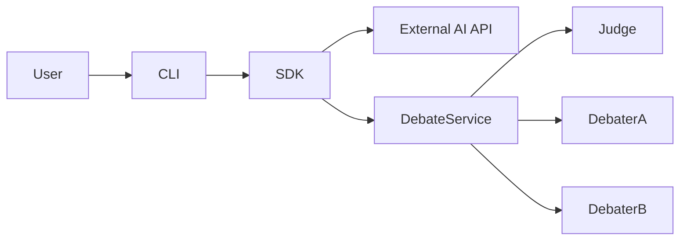

# Architecture & Implementation Plan - AI Debate Platform

## 1. System Architecture
The system follows a layered architecture as prescribed by the guidelines:
- **SDK Layer:** Abstract interface for AI model interactions.
- **Domain/Service Layer:** Debate logic, turn management, and scoring.
- **Infrastructure Layer:** Configuration management, API Gatekeeper, and logging.
- **CLI Layer:** User interface for starting and monitoring debates.

## 2. Component Diagram (C4 Model - Level 1)

## 3. Technology Stack
- **Environment:** `uv` for dependency management.
- **API Communication:** `httpx` or specialized SDKs (OpenAI, Anthropic).
- **Testing:** `pytest`, `pytest-cov`, `pytest-asyncio`.
- **Linting:** `ruff`.
- **Configuration:** JSON/YAML and `.env`.

## 4. Key Components
### 4.1 SDK (src/sdk/ai_client.py)
- Unified interface for different AI providers.
- Handles retries, timeouts, and rate limiting (via Gatekeeper).

### 4.2 API Gatekeeper (src/shared/gatekeeper.py)
- Centralized control for all API calls.
- Implements rate limiting and queuing.

### 4.3 Debate Manager (src/services/debate_manager.py)
- Orchestrates the flow of the debate.
- Manages the state and history of 20 messages.

### 4.4 Scoring Engine (src/services/judge.py)
- Specialized logic for the judge model to evaluate the debate.

## 5. Development Strategy
1. **Phase 1: Setup** - Initialize `uv`, `pyproject.toml`, and directory structure.
2. **Phase 2: Shared Utilities** - Implement Gatekeeper, Config Manager, and Logging.
3. **Phase 3: SDK Development** - Create the abstract AI client and provider implementations.
4. **Phase 4: Core Logic** - Implement Debater and Judge classes.
5. **Phase 5: Orchestration** - Implement the Debate Manager.
6. **Phase 6: CLI & Testing** - Finalize the CLI and ensure 85% test coverage.

## 6. Constraints & Compliance
- **Line Limit:** Strict enforcement of <150 lines per file.
- **Modularization:** Use of Mixins and Base classes to avoid code duplication.
- **TDD:** Write tests before implementation.
- **Documentation:** Maintain `Prompt Engineering Log` for all AI prompts.
